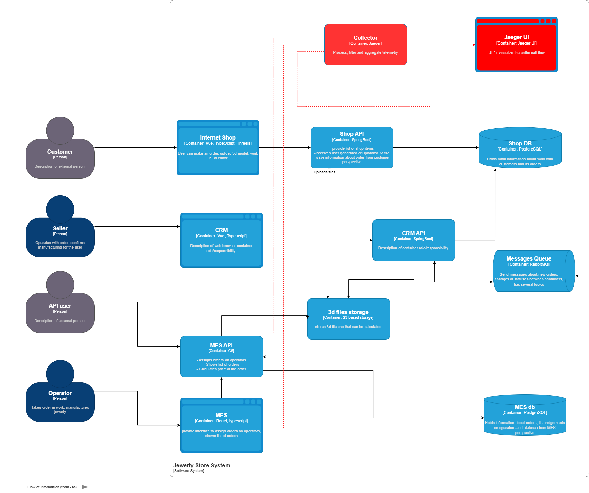

### Архитектурное решение

Нам нужно отследить путь заказа и понять, на каком этапе проблема, поэтому трейсинг мы применим к следующим сервисам: CRM API, MES API, MES

В трейсинг будут попадать следующие данные:
* ID заказа
* статус заказа
* временные метки, показывающие время прохождения каждого этапа/сервиса

### Мотивация

Основной проблемой системы в данный момент является зависание или пропадание заказов. Внедрение трейсинга позволит:
* отслеживать путь заказа и быстро находить причины задержки/сбоя обработки
* находить "бутылочные горлышки" в системе, что позволит планировать их устранение
* находить и превентивно исправлять "зависшие заказы", что улучшит пользовательский опыт
* быстрее находить и исправлять ошибки

### Предлагаемое решение
* добавить в компоненты CRM API, MES API, MES поддержку OTel через sdk
* Установить Jaeger инструмент для визуализации с сборки трейсинга

# диаграмма

### Компромиссы
* Трассировка - штука тяжелая и требует экспертизы команды
* Возможно будет сложно внедрить в MES компонент, так как он куплен у вендора (но есть исходный код и попытаться можно)
* Неизберательная трассировка - требудет большого количества ресурсов, как для работы так и для хранения данных
* Сложно заставить проприетарную систему отдавать метрики в нужном формате, может потребоваться дорогостоящая доработка.

### Безопасность
* Настроить авторизацию в jaggerUI
* Все соединения организовывать по https
* Настроить ролевую модель доступа пользователей к jagger