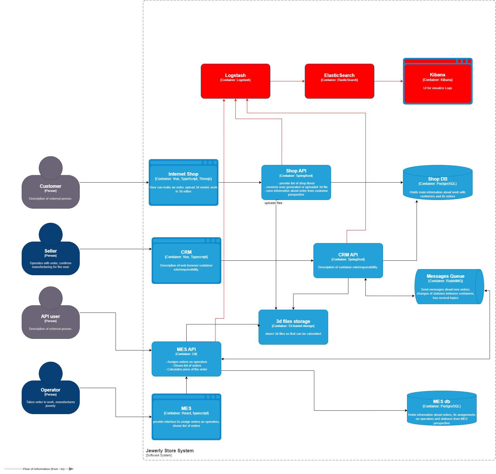

### Архитектурное решение
Основные сервисы, чьи логи нас интересуют - CRM API, MES, MES API

Логгирование с уровнем INFO вводим для всех основных событий системы (описанных в начале задания), события записи/чтения в rabbit,
Создание, обновление, вход в систему пользователей.

## Другие уровни логов
* DEBUG для отладки разработчиками на их усмотрение
* WARN - все нештатные события не влияющие на основной функционал
* ERROR - все нештатные события приводящие к сбою работы

### Мотивация

Логипование - главный инструмент для проверки работы программы, поиска ошибок, анализа сбоев и в некоторых случаях бизнес процессов.
Грамотно составленные логи позволяют сотрудникам поддержки без вмешательства разработчиков анализировать и в некоторых случаях исправлять инцеденты.
Логи позволяют локализовать ошибки, что упрощает последующий разбор и исправление.
Логи позволяют отследить сбои компонентов системы и часто причину (например кончился пул подключений к БД).
Логи позволяют оценить работу пользователей (включая нештатную) и дать обратную связь.

В первую очередь логирование и трейсиг надо настроить на основных проблемных компонентах - MES, MES API.

### Предлагаемое решение

1) Решение для логирования будет использовано на базе стека ELK.
2) Нужно донастроить сами логи в сервисах.
3) Сделать обусификацию чувствительных данных.
4) Нужно нормализовать вывод логов формате json. (в файл или в stdout)
5) Настроим основные поля в логах
   * date
   * module
   * log level
   * message
6) Настроить сбор логов через ELK
7) Нужно настроить доступ в Kibana и создать ролевую модель.
8) Все логи будут храниться в одном индексе
9) Настраиваем Index Lifecycle Policies, в Hot phase храним за 1 день или 1 гигабайт. Дальше в cold phase. Общий срок хранения - месяц
10) В процессе эксплуатации анализируем логи, убираем лишние, добавляем нужные, настраиваем Index Lifecycle Policies
# диаграмма

### Мероприятия для превращения системы сбора логов в систему анализа логов

Для превращения в систему анализа логов можно настроить алертинг, но не стоит дублировать его с метриками из grafana

* Оповещения об аномалиях
* Оповещения о критических ошибках

Так же в ELK можно анализировать логи за периоды и делать соответствующие выводы по техническим и бизнес процессам, например
* тенденции в изменении количества заказов
* пиковые периоды
* нестандартное пользовательское поведение