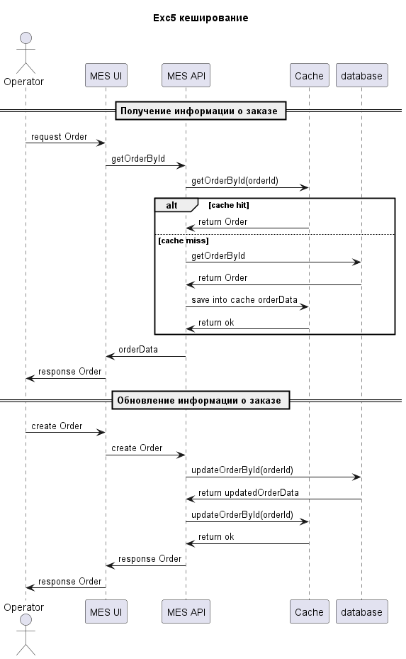

### Мотивация

У нас есть жалобы на работу страниц в MES сервисе, система долго прогружается, тормозит, потому кеширование в первую очередь надо добавить сюда.
Операторам важно видеть новые заказы, поэтому их кеширование - ускорит выдачу заказов операторам.
Так как MES - это фронт к MES API, то реализовывать его будем в MES API.

### Предлагаемое решение
В сервисе у нас есть основные операции на чтение (получение списка заказов) и запись (создание заказов), поэтому решено применить 2 паттерна:
Read-Through и Write-Through. Эти патерны помогут поддерживать кеш в актуальном состоянии,
Write-Through позволит нам обновлять данные при записи, что позволит всегда иметь последние заказы в кеше. Простой паттерн, легко реализовать.
Read-Through обеспечивает кеширование данных на чтение.

Другие паттерны менее подходят для нашего случая.
Cashe-aside - только для чтения и может быть неконсистеноность данных, что плохо для наших задач.
Refresh-ahead - сложнее в реализации, нужно прорабатывать алгоритм добавления данных и тоже только на чтение

# диаграмма

## инвалидация кеша

При выбранных патернах кеширования инвалидация кеша не нужна, так как данные всегда будут актуальные.
Система е предполагает гигантских объемов данных, потому скорее всего даже если закешировать все заказы, ресурсов будет потрачено немного.

Хорошим вариантом при запуске сервиса - будет прогрев кеша. Например, запрос 1000 последних заказов
